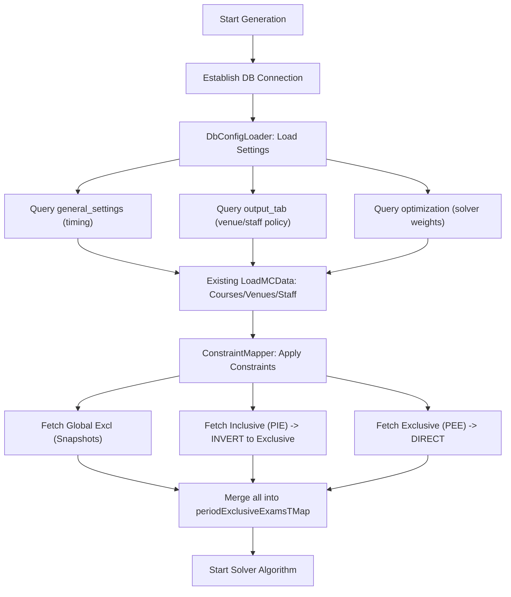

# Refactor Directive: Migrating Generation Logic to DB-Driven Config

This document provides step-by-step instructions for refactoring the timetable generation entry point on the logic machine. The goal is to replace all hardcoded parameters with database lookups from the `examtt3` schema.

## 1. Prerequisites & Rules

- Ensure the `generation-logic/` folder is copied to the logic machine's source path.
- Include `DbConfigLoader.java` and `ConstraintMapper.java` in the project build.
- **Package Name**: The utilities use `package generation_logic;`. If you move them to the default source folder, **delete** the first line of the `.java` files. If you keep them in the folder, add `import generation_logic.*;` to your main App class.
- > [!IMPORTANT]
  > **DO NOT TOUCH EXISTING COMMENTS**: All comments (e.g., `// SA150723`) must be preserved exactly as they are. The refactor should only replace the hardcoded value assignments with database pulls.

## 2. Algorithm & Logic Flow

The following diagram illustrates how the refactored logic pulls data and prepares the solver:



## 3. Configuration & Parameter Migration

### Phase 0: Database Connection

The logic machine doesn't hardcode the URL in the utilities. Instead, it expects a live `Connection` object.
In your main App code, maintain the existing logic for choosing the `db_url` based on `isRegularExamTT`, then pass `conn` to the loader:

```java
Connection conn = DriverManager.getConnection(db_url, user, pass);

// These IDs should be provided by your triggering mechanism (e.g., CLI args or a trigger table)
Long activeGsId = ...;
Long activeOtId = ...;
Long activeEtId = ...;
Long activeOsId = ...;

DbConfigLoader.loadAll(cData, conn, activeGsId, activeOtId, activeEtId, activeOsId);
```

> [!TIP]
> **Selection Logic**: If you pass `null` for an ID, the loader will default to the **Latest Record** in that table. This allows for both "Precise Selection" and "Auto-Latest" modes.

### Phase A: Global Timing & Session Info

**Manual Code (Line 108-135):**
Replace hardcoded `enteredSDate`, `session`, `semester`, `pPerDay`, `noOfWks` with:

```java
// Pass nulls to use latest, or specific IDs for the Active Triad
DbConfigLoader.loadAll(cData, conn, activeGsId, activeOtId, activeEtId, activeOsId);

// After loading, ensure pPerDay and noOfWks are synced
pPerDay = cData.getpPerDay();
noOfWks = cData.getNoOfTTWeeks();
```

### Phase B: Solver Optimization Policies

**Manual Code (Line 181-221):**
Remove manually assigned values for:

- `venueSelOrder`, `venueSelPolicy`
- `examSchedullingPolicy`
- `mixedExamsInVenue`, `largeExamFullyInVenue`
- `selectStaffRand`, `updateStaffDutyCount`

These are now handled by `DbConfigLoader.loadFromOutputTab(cData, conn);`.

### Phase C: Constraint Migration (PIE/PEE)

**Manual Code (Line 711-736):**
Replace the entire `if(cData.isHasPeriodExclusiveExams())` block (containing the hardcoded `int[][] all` and `String[] cCodeA`) with:

```java
Long activeConstraintId = ...;
Long activeExclusionId = ...; // Snapshot ID

ConstraintMapper.applyConstraints(cData, enCourseL, conn, maxPCount, periodExclusiveExamsTMap, activeConstraintId, activeExclusionId);
```

**Inversion Logic Note:** This call will automatically handle the "Course(Periods)" format and invert inclusive constraints into exclusive ones.

## 3. Logical Recommendations (Database Extensions)

### Recommendation 1: Selective Enrollment Table

**Current Logic (Line 490-509):** Hardcodes specific exams like `FST310`.
**Directive:**
Create a table `selective_exams_config` with columns: `course_code`, `program_codes` (comma-sep), `levels` (comma-sep).
Modify the loader to populate `ArrayList<ExamInfo4SelSchedule> spExamDataL` from this table.

### Recommendation 2: Non-Exam Courses

**Current Logic (Line 581-590):** Reads from `UniWideNonExamC.csv`.
**Directive:**
Create a table `non_exam_courses` with `course_code`.
Replace `CSVUtil.ReadNonExaminableCourseCodesCSVFile` with a DB query.

## 4. Integration Checklist

1. [ ] Remove all hardcoded variables in the "General Properties" section.
2. [ ] Ensure `DbConfigLoader` is called after the `Connection` is established but BEFORE any data loading logic.
3. [ ] Verify that `maxPCount` is calculated AFTER pulling `pPerDay` and `noOfWks` from the DB.
4. [ ] Test with a simple constraint (e.g., `CSC101(1,2)`) in `constraint_table` to verify PIE inversion.
