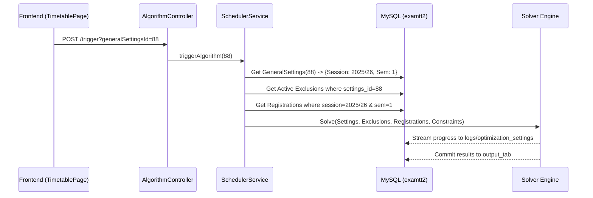

# 🧠 Algorithm Integration & Data Bundling Specs

This document outlines the business logic and data payload requirements for the **Bells University Timetable Generation Engine**.

---

## 🏗️ 1. The Anchor: Multi-ID Triple-Lock

To ensure 100% precision, the frontend passes the specific IDs for every critical configuration table currently loaded in the user's view.

- **Trigger Endpoint**: `POST http://localhost:8080/algorithm/trigger`
- **Required Parameters**:
  - `generalSettingsId`: {long} The ID of the primary institutional config.
  - `constraintId`: {int} (Optional) The ID of the constraint ledger.
  - `exclusionSnapshotId`: {long} (Optional) The ID of the period exclusion snapshot.
- **Precision**: This triple-lock prevents the backend from guessing which "Latest" record to use, especially in environments where multiple admins might be saving settings simultaneously.

---

## 📦 2. Context Retrieval & Data Assembly

When the engine initializes, the `SchedulerService` assembles the data bundle by pulling the **Exact Records** requested:

### A. Record Pulling Logic

| Component             | Logic                                                                |
| :-------------------- | :------------------------------------------------------------------- |
| **General Settings**  | Fetches `GeneralSettings` by provided `generalSettingsId`.           |
| **Constraint Matrix** | Fetches `Constrainttable` by provided `constraintId`.                |
| **Exclusion Vector**  | Fetches `PeriodExclusionSnapshot` by provided `exclusionSnapshotId`. |

### B. Logical Context Extraction

Once the exact records are loaded, the system extracts the academic context:

- **Session Chain**: extracted from `GeneralSettings.session` (e.g., `"2025/2026"`).
- **Student Roll**: Queries `registration` where `session == root.session`.
  |

---

## 🔄 3. Integration Workflow (The Solver Bundle)



---

## ✅ 4. Pre-Flight Readiness Validation

The "Initiate" button is gated by a multi-pillar business check:

1.  **Session/Semester**: Validated in the Root Config.
2.  **Grid Topology**: Dimensions must be defined (Periods > 0).
3.  **Constraint Ledger**: At least one hard constraint must be present.
4.  **Exclusion Matrix**: An active snapshot must be present (System verifies review has occurred).

---

## 🛠️ 5. Implementation for Solver Cycle

The solver interprets the `excludedPeriods` from the Snapshot as an **Input Mask**:

```java
// Logic inside Algorithm Solve Loop
for (int slotIndex = 0; slotIndex < totalSlots; slotIndex++) {
    if (activeExclusions.contains(slotIndex)) {
        matrix[slotIndex].isAvailable = false; // Block slot from allocation
    }
}
```

**Status:** Implementation Ready  
**Architecture:** Zero-Trust Relational Mapping v4.0

---

## 🌐 6. Distributed Engine Orchestration

The Bells University generation logic is designed for **Edge Execution**. This means the generation engine can reside on an external high-compute machine while the main application server handles the orchestration.

### A. The Remote Handshake

1.  **Orchestrator Role**: The main server (Localhost:8080) receives the **Triple-Lock IDs** from the frontend.
2.  **Edge Trigger**: The server proxies this request (or makes a secondary call) to the **External Node IP**.
3.  **Autonomous Pulling**: Because the IDs are for a shared Database (`examtt2`), the External Node uses the IDs to pull its own "Respective Bundle" directly from the database, eliminating the need to transmit large data blobs over HTTP.

### B. Scalability Specs

- **Engine Multi-Tenancy**: Multiple external nodes can be spun up during peak registration cycles.
- **Callback Mechanism**: External nodes report progress to the `optimization_settings` table via the shared DB, which the frontend continues to poll locally.

**Status:** Implementation Ready  
**Architecture:** Distributed Zero-Trust Mapping v4.1 (External Compatible)
